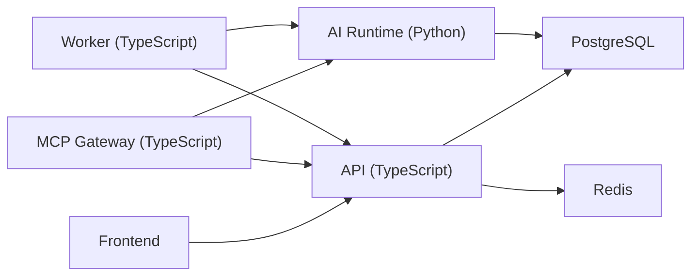

# 新点 SaaS 造价系统后端重构方案

> 基于 [backend-tech-stack-redecision.md](/Users/huahaha/Documents/New%20project/docs/architecture/backend-tech-stack-redecision.md) 的结论展开。  
> 本文档不再把 `Java + Spring Boot` 视为当前主线，而是将后端正式重构为：
>
> `TypeScript 主后端 + Python AI 子系统`

## 1. 当前正式决定

从现在开始，正确的动作不是继续扩大 Java 代码面积，而是：

1. 冻结当前 Java 实现为业务规则验证样本
2. 以 `TypeScript` 重新建立主业务后端
3. 以 `Python` 单独建立 AI Runtime / Knowledge / Memory 子系统
4. 把 `MCP / skills / context aggregation` 视为一等能力，而不是外挂功能

## 2. 新架构的目标

这次重构不是为了“换语言”，而是为了同时满足 4 个目标：

- 业务主链仍然可控
- AI 能力不再依附于业务系统边角
- MCP / skills / agent 集成顺畅
- 知识沉淀和系统记忆可以长期演进

## 3. 新的系统拆分

推荐单仓多目录继续保留，但后端拆分方式调整为：

```text
New project/
├── apps/
│   ├── api/                # TypeScript 主业务后端
│   ├── ai-runtime/         # Python AI 子系统
│   ├── mcp-gateway/        # TypeScript MCP / tool / context gateway
│   ├── worker/             # TypeScript 异步任务
│   └── frontend/           # React + TypeScript
├── docs/
├── deploy/
└── legacy/
    └── backend-java/       # 当前 Java 原型冻结归档
```

### 3.1 `apps/api`

这是新的主业务后端，负责：

- 项目、阶段、成员、权限
- 清单版本链、清单树、工作内容
- 定额、价目、取费、计价规则
- 审核、锁定、提交、撤回
- 汇总、报表任务、导入导出任务提交

这层必须保持：

- 强类型
- 可测试
- 权限边界明确
- 不直接承载复杂 AI 推理逻辑

### 3.2 `apps/ai-runtime`

这是新的 Python AI 子系统，负责：

- embedding / retrieval
- RAG
- 知识抽取
- 记忆生成
- agent workflow
- recommendation orchestration
- 知识图谱 enrichment

这层不负责：

- 正式业务写入主事务
- 绕过权限直接改业务数据

### 3.3 `apps/mcp-gateway`

这是 TypeScript MCP 能力层，负责：

- `resource` 暴露
- `tool` 封装
- `project/stage/bill` 上下文聚合
- permissions 裁剪
- 将业务系统和 AI runtime 打包成统一 agent-facing interface

### 3.4 `apps/worker`

这是 TypeScript 异步执行层，负责：

- 导出任务
- 批量重算
- 导入解析
- 调用 `ai-runtime`
- 写入 AI 推荐结果
- 写入知识抽取任务状态

## 4. 为什么主业务后端选 TypeScript

主业务后端重新推荐 `TypeScript`，不是因为它“更潮”，而是因为它更适合本项目现在的真正目标：

- 和前端同语言，业务迭代快
- 更适合做 MCP / tool / context gateway
- 和 OpenAI / agent / streaming 交互更顺
- 未来 skills 封装、上下文聚合、事件流更自然
- 不会把 AI 能力隔离成难以协作的次级体系

推荐技术组合：

- `TypeScript`
- `NestJS` 或 `Fastify`
- `Zod`
- `Prisma` 或 `Drizzle`
- `BullMQ`
- `PostgreSQL`
- `Redis`

## 5. 为什么 AI 子系统用 Python

Python 在这里不是“第二后端”，而是：

`AI 能力核心运行层`

推荐它承接：

- knowledge extraction
- memory summarization
- embeddings
- retrieval pipeline
- RAG
- recommendation engine
- multi-step agent workflow

推荐技术组合：

- `Python 3.11+`
- `FastAPI`
- `Pydantic`
- `LangGraph`
- `OpenAI Agents SDK`
- `pgvector`
- `Celery` 或直接由外部队列驱动

## 6. 新的职责边界

### 6.1 业务写入边界

正式业务写入只能通过 `apps/api`。

这意味着：

- AI 子系统可以给建议
- 不能直接改正式清单、定额、审核状态
- 最终写入仍由业务后端执行

### 6.2 AI 建议边界

AI 子系统输出的应该是：

- recommendation
- explanation
- confidence
- supporting context

而不是：

- 直接覆盖业务数据

### 6.3 MCP 边界

`mcp-gateway` 不直接查库，不直接执行业务写入。  
它只做：

- 高层资源封装
- 工具路由
- 上下文聚合
- 权限裁剪

## 7. 推荐的服务间交互



### 原则

- 业务事实来源在 `API`
- AI 读取上下文可经 `API` 或 `MCP Gateway`
- AI 输出建议回写 `API`

## 8. 数据层建议

数据库仍推荐保留：

- `PostgreSQL`
- `Redis`
- `Object Storage`

因为问题不在数据库，而在后端运行时边界。

### 8.1 PostgreSQL

继续作为：

- 主业务库
- 配置库
- 审计日志
- 知识条目
- 记忆条目
- 向量检索底层

### 8.2 pgvector

建议直接作为 `knowledge / memory / case retrieval` 的底层能力，而不是额外引入新数据库。

## 9. 新目录建议

## 9.1 `apps/api`

```text
apps/api/
├── src/
│   ├── app/
│   ├── modules/
│   │   ├── auth/
│   │   ├── project/
│   │   ├── discipline/
│   │   ├── bill/
│   │   ├── quota/
│   │   ├── pricing/
│   │   ├── review/
│   │   ├── report/
│   │   ├── import/
│   │   └── audit/
│   ├── infrastructure/
│   ├── shared/
│   └── main.ts
├── prisma/
└── test/
```

## 9.2 `apps/ai-runtime`

```text
apps/ai-runtime/
├── app/
│   ├── api/
│   ├── agents/
│   ├── retrieval/
│   ├── embeddings/
│   ├── knowledge/
│   ├── memory/
│   ├── graph/
│   └── providers/
├── tests/
└── main.py
```

## 9.3 `apps/mcp-gateway`

```text
apps/mcp-gateway/
├── src/
│   ├── resources/
│   ├── tools/
│   ├── context/
│   ├── permissions/
│   └── server.ts
└── test/
```

## 10. 当前 Java 代码怎么处理

当前 `apps/backend` 不建议继续扩展。

推荐处理方式：

1. 将其标记为 `legacy validation prototype`
2. 提取其中已经验证过的业务规则：
   - 成员权限边界
   - 版本锁定规则
   - 清单版本复制链
   - 提交/撤回状态机
   - 提交前校验摘要规则
3. 将这些规则迁移到新的 TypeScript `apps/api`

### 不能继续做的事

- 不要继续在 Java 上叠加更多模块
- 不要再把 Java 原型误认为主线

## 11. 迁移优先级

推荐按下面顺序迁移：

1. `project + stage + member + permission`
2. `bill_version + bill_item + work_item`
3. `submit / withdraw / lock / validation-summary`
4. `quota / pricing`
5. `review / reporting`
6. `MCP / AI runtime / knowledge / memory`

## 12. 对现有文档体系的影响

从现在开始，以下文档需要被视为“待替换或重写”：

- [technical-architecture-and-platform-selection.md](/Users/huahaha/Documents/New%20project/docs/architecture/technical-architecture-and-platform-selection.md)
- [backend-project-skeleton-design.md](/Users/huahaha/Documents/New%20project/docs/architecture/backend-project-skeleton-design.md)
- [backend-implementation-checklist.md](/Users/huahaha/Documents/New%20project/docs/architecture/backend-implementation-checklist.md)

它们不是失效，而是：

`其中与 Java 主后端绑定的部分不再作为当前执行基线。`

## 13. 当前执行基线

当前正确执行顺序应为：

1. 以本文件和 [backend-tech-stack-redecision.md](/Users/huahaha/Documents/New%20project/docs/architecture/backend-tech-stack-redecision.md) 为新的技术基线
2. 暂停继续扩大 Java 代码
3. 新建 `apps/api` / `apps/ai-runtime` / `apps/mcp-gateway`
4. 从 Java 原型迁移已验证规则

## 14. 一句话结论

正确的下一步不是继续维护 `Java + Spring Boot` 主线，  
而是正式切换为：

`TypeScript 主业务后端 + Python AI 子系统 + TypeScript MCP Gateway`

并把当前 Java 代码降级为迁移来源，而不是未来主系统。
