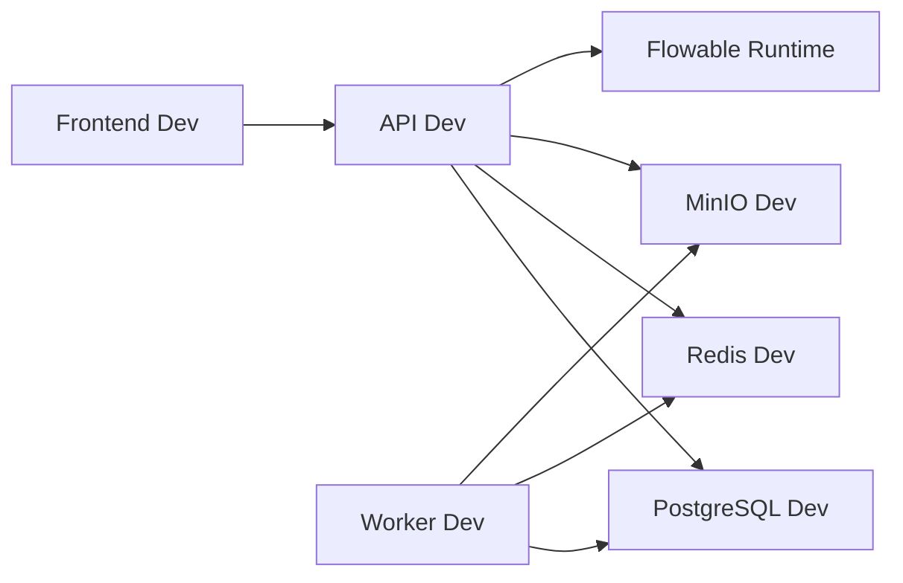
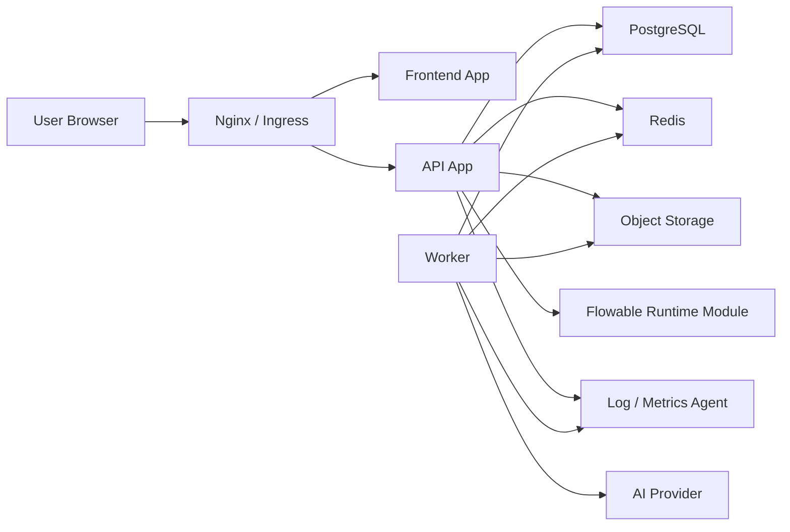

# 新点 SaaS 造价系统部署架构设计

> 基于 [technical-architecture-and-platform-selection.md](/Users/huahaha/Documents/New%20project/docs/architecture/technical-architecture-and-platform-selection.md)、[workflow-and-form-engine-design.md](/Users/huahaha/Documents/New%20project/docs/architecture/workflow-and-form-engine-design.md) 与 [master-delivery-roadmap.md](/Users/huahaha/Documents/New%20project/docs/architecture/master-delivery-roadmap.md) 展开。

## 1. 文档目标

这份文档用于补齐当前系统在“环境与部署层”的设计。

它重点回答：

- 开发、测试、生产三套环境怎么分
- API、Worker、数据库、缓存、对象存储怎么部署
- 流程引擎、表单配置、AI 调用在部署上怎么落位
- 日志、监控、备份、容灾最少要做到什么程度
- V1 推荐的部署复杂度是什么

## 2. 部署设计原则

## 2.1 V1 先追求稳定和可维护

V1 的重点不是做“最炫的云原生架构”，而是：

- 能快速搭起来
- 能稳定联调
- 能定位问题
- 能支撑后续扩容

所以部署原则是：

`模块化单体应用 + 独立 Worker + 标准中间件 + 清晰环境分层`

## 2.2 环境隔离必须明确

至少分成三套环境：

- `dev`
- `test`
- `prod`

如果团队允许，建议补一个：

- `staging`

但 V1 最小可接受方案就是三套。

## 2.3 业务数据与文件必须分开存

必须坚持：

- 业务元数据走 PostgreSQL
- 文件实体走对象存储
- 临时任务状态走 Redis

不要把大文件塞数据库，也不要把流程元数据散到文件系统里。

## 3. 环境分层设计

## 3.1 开发环境 `dev`

目标：

- 本地开发
- 单人联调
- 快速迭代

建议组件：

- `frontend-dev`
- `api-dev`
- `worker-dev`
- `postgres-dev`
- `redis-dev`
- `minio-dev`

### 特点

- 可用 `docker compose` 一键启动
- 流程引擎和主 API 一起跑
- AI Provider 可接测试 Key 或 Mock

### 推荐方式

## 3.2 测试环境 `test`

目标：

- 前后端联调
- 测试回归
- 导入导出验证
- 流程和权限回归

建议组件：

- `frontend-test`
- `api-test`
- `worker-test`
- `postgres-test`
- `redis-test`
- `minio-test`
- `nginx-test`

### 特点

- 数据与开发环境隔离
- 测试环境允许导入样本数据
- 可以接真实 AI Provider，也可以继续使用 Mock

### 注意

- 测试环境不能和生产共用数据库
- 对象存储 bucket 也必须隔离

## 3.3 生产环境 `prod`

目标：

- 稳定服务业务用户
- 支撑正式项目数据
- 可监控、可备份、可恢复

建议组件：

- `frontend-prod`
- `api-prod`
- `worker-prod`
- `postgres-prod`
- `redis-prod`
- `object-storage-prod`
- `nginx / ingress`
- `monitoring`
- `logging`

## 4. 推荐部署拓扑

## 4.1 V1 推荐拓扑

### 说明

- `Frontend App` 可以做成静态资源托管
- `API App` 作为模块化单体对外提供 REST API
- `Worker` 独立处理导入、导出、批量重算、AI 推荐
- `Flowable Runtime` 作为 API 内模块，不单独拆服务

## 4.2 为什么流程引擎先不独立部署

因为 V1 里流程流量不是最大瓶颈，独立部署 Flowable 的收益不高，反而会增加：

- 认证对接复杂度
- 数据一致性复杂度
- 维护成本

所以 V1 推荐：

- `Flowable engine embedded in API`

V1.1 或更后期，如果流程平台化需求明显增强，再考虑独立拆出。

## 5. 容器与部署方式建议

## 5.1 开发环境

推荐：

- `Docker Compose`

原因：

- 最简单
- 最适合本地和轻量联调
- 团队上手成本低

## 5.2 测试与生产环境

推荐优先级：

1. 有运维基础时：`Kubernetes`
2. 资源较少时：`Docker Compose + Systemd + Nginx`

### 如果团队当前较小

V1 可以接受：

- 测试环境：Docker Compose
- 生产环境：2 台应用机 + 1 台数据库/缓存/存储机

### 如果团队已有 K8s 基础

推荐：

- Frontend Deployment
- API Deployment
- Worker Deployment
- ConfigMap / Secret
- PVC / 外部数据库
- Ingress

## 6. 组件部署建议

## 6.1 Frontend

推荐：

- 静态资源构建后由 `Nginx` 托管
- 或直接放到对象存储 + CDN

V1 如果是私有化部署，更推荐：

- `Nginx + 静态资源`

## 6.2 API App

推荐：

- 1 个主 API 服务
- 支持水平扩展
- 无状态设计

### 关键要求

- Session 不落本机
- 文件不落本机
- 认证和任务状态依赖 Redis / DB

## 6.3 Worker

Worker 单独部署，至少处理：

- 报表导出
- 批量重算
- 初始导入
- AI 推荐

### 原则

- Worker 和 API 共享数据库
- 但部署进程独立
- 可以按任务量水平扩容

## 6.4 PostgreSQL

V1 推荐：

- 测试环境单实例
- 生产环境主从或云托管实例

### 最低要求

- 自动备份
- WAL/增量备份能力
- 定期恢复演练

## 6.5 Redis

V1 推荐：

- 单实例即可

如果生产要求更高，可以：

- Redis Sentinel
- 托管 Redis

主要用途：

- 缓存
- 任务状态
- 分布式锁

## 6.6 对象存储

开发/测试：

- `MinIO`

生产：

- 私有化优先 `MinIO`
- 云部署优先 `S3 / OSS / COS`

### Bucket 规划建议

- `import-files`
- `export-files`
- `attachments`
- `temp-files`

## 7. 配置管理设计

## 7.1 环境变量分类

建议按下面分组：

- 数据库配置
- Redis 配置
- 对象存储配置
- JWT 配置
- AI Provider 配置
- 日志配置
- 流程引擎配置

## 7.2 Secret 管理

必须作为 Secret 管理的内容：

- 数据库密码
- Redis 密码
- 对象存储 AK/SK
- JWT 密钥
- AI Provider Key

不要写死在代码仓库或前端配置中。

## 8. 日志与监控

## 8.1 日志设计

建议日志至少分三类：

- 应用日志
- 审计日志
- 任务日志

### 应用日志

关注：

- 请求耗时
- 异常堆栈
- SQL 慢查询
- 外部依赖调用失败

### 审计日志

继续保存在业务数据库里的 `audit_log` 表。

### 任务日志

重点记录：

- 导入任务
- 导出任务
- 重算任务
- AI 调用任务

## 8.2 监控建议

V1 建议至少接：

- 应用存活监控
- JVM 指标
- 数据库连接池指标
- Redis 指标
- 任务成功/失败数
- 报表导出耗时
- AI 调用失败率

### 推荐组合

- `Prometheus`
- `Grafana`
- `Loki` 或 ELK（后续）

如果当前团队还没有这套基础，V1 最低也要做到：

- 健康检查接口
- 错误日志集中收集
- 关键任务失败告警

## 9. 备份与容灾

## 9.1 最低要求

生产环境必须至少具备：

- PostgreSQL 每日全量备份
- 关键时段增量/WAL 备份
- 对象存储版本化或定时备份
- 配置文件备份

## 9.2 恢复演练

不是只做备份，还要验证恢复。

建议至少每月做一次：

- 测试环境恢复演练

验证：

- 数据库是否可恢复
- 导出文件是否可访问
- 流程定义和表单配置是否可恢复

## 10. 安全设计

## 10.1 网络边界

建议：

- 只有 Nginx / Ingress 暴露公网
- PostgreSQL、Redis、MinIO 不直接暴露公网
- Worker 走内网调用

## 10.2 访问控制

必须具备：

- HTTPS
- JWT 认证
- 管理端权限控制
- 对象存储私有 bucket

## 10.3 文件安全

上传文件建议做：

- 文件类型限制
- 文件大小限制
- 文件名脱敏或重命名
- 导入文件病毒扫描预留

## 11. AI 组件部署建议

V1 不建议自建大模型服务。

推荐：

- API / Worker 调外部 AI Provider

### 原则

- AI 调用只出现在 Worker 或异步流程里
- 不阻塞主业务提交链
- 有超时、重试和降级策略

### 建议

- Provider Key 只放后端
- 前端绝不直接调模型 API

## 12. 环境启动顺序建议

无论是测试还是生产，建议按这个顺序启动：

1. PostgreSQL
2. Redis
3. Object Storage
4. API App
5. Worker
6. Frontend
7. 监控与日志组件

这样最容易定位启动失败原因。

## 13. V1 推荐部署方案总结

## 13.1 小团队私有化部署

推荐：

- `Nginx + Frontend`
- `1~2 个 API 实例`
- `1 个 Worker`
- `1 个 PostgreSQL`
- `1 个 Redis`
- `1 个 MinIO`

## 13.2 云上托管部署

推荐：

- 前端静态托管
- API 容器化部署
- Worker 容器化部署
- 托管 PostgreSQL
- 托管 Redis
- 对象存储服务

## 14. 一句话结论

V1 最适合的部署架构是：

`前端静态站点 + 模块化单体 API + 独立 Worker + PostgreSQL + Redis + 对象存储的标准三层部署方案，在开发用 Docker Compose，测试/生产按团队条件选择 Compose 或 Kubernetes。`

