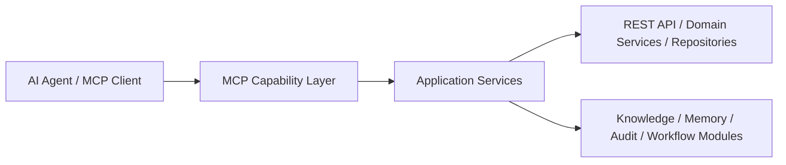

# 新点 SaaS 造价系统 MCP 能力层设计

> 基于 [ai-native-architecture-review.md](/Users/huahaha/Documents/New%20project/docs/architecture/ai-native-architecture-review.md)、[openapi-v1.yaml](/Users/huahaha/Documents/New%20project/docs/api/openapi-v1.yaml)、[data-model.md](/Users/huahaha/Documents/New%20project/docs/architecture/data-model.md) 与 [workflow-and-form-engine-design.md](/Users/huahaha/Documents/New%20project/docs/architecture/workflow-and-form-engine-design.md) 展开。

## 1. 文档目标

这份文档用于把“AI 如何稳定使用本系统”正式设计出来。

它重点回答：

- 系统要暴露哪些 MCP 能力
- 哪些更适合做 `resource`
- 哪些更适合做 `tool`
- AI 拿到的上下文结构应该是什么样
- 权限如何在 MCP 层裁剪
- MCP 层如何与现有 REST API 和业务服务对齐

## 2. 为什么需要 MCP 能力层

当前系统已经有 REST API，但那主要是为前后端页面联调设计的。

AI Agent 真正需要的不是“更多 endpoint”，而是：

- 稳定的资源入口
- 面向任务打包好的上下文
- 对长链路对象关系的聚合视图
- 对权限裁剪后的可读结果
- 对语义更友好的返回结构

所以 MCP 层的定位不是替代 REST API，而是：

`在现有业务服务之上，为 AI 提供更适合读取、搜索、推理和执行任务的能力接口层。`

## 3. MCP 层定位

## 3.1 逻辑位置

建议放在：

`业务服务层之上，Agent 能力层之下`

逻辑结构如下：



### 原则

- MCP 层不直接绕过业务服务查库
- MCP 层调用应用服务
- 应用服务继续做权限和状态校验

## 3.2 三类能力

建议把 MCP 能力分成 3 类：

### 资源类 `resources`

适合：

- 稳定读取
- 上下文打包
- 可缓存

### 查询类 `tools`

适合：

- 条件搜索
- 语义检索
- 聚合分析

### 动作类 `tools`

适合：

- 提交
- 审核
- 生成建议
- 发起任务

## 4. 资源分层设计

建议把 MCP 资源分成 5 层。

## 4.1 项目上下文资源

### `project-context`

用于让 AI 一次性拿到某项目的高层上下文。

建议内容：

- 项目基础信息
- 当前阶段
- 启用阶段列表
- 项目专业配置
- 默认定额集和价目配置
- 当前主要风险摘要
- 最近关键操作摘要

建议资源 URI 形式：

- `pricing://project/{projectId}/context`

## 4.2 阶段上下文资源

### `stage-context`

用于承接阶段级任务。

建议内容：

- 阶段基础信息
- 阶段状态
- 当前阶段负责人/审核人
- 当前主清单版本
- 待审核对象数量
- 当前阶段异常提示

建议 URI：

- `pricing://project/{projectId}/stage/{stageCode}/context`

## 4.3 清单与定额上下文资源

### `bill-version-context`

建议内容：

- 当前版本基础信息
- 来源版本
- 锁定状态
- 清单数量统计
- 校验错误摘要
- 差异摘要
- 关联过程单据摘要

URI：

- `pricing://bill-version/{versionId}/context`

### `bill-item-context`

建议内容：

- 清单项基础信息
- 工作内容
- 关联定额摘要
- 来源链摘要
- 最近修改记录
- AI 推荐摘要

URI：

- `pricing://bill-item/{itemId}/context`

### `quota-context`

建议内容：

- 定额基础信息
- 定额来源
- 价目版本
- 取费模板
- 校验状态
- 人工调价痕迹

URI：

- `pricing://quota-line/{lineId}/context`

## 4.4 流程与审核资源

### `review-context`

建议内容：

- 提交对象
- 提交类型
- 当前流程节点
- 当前待办人
- 历史审批记录
- 驳回原因标签

URI：

- `pricing://review-submission/{submissionId}/context`

### `workflow-instance-context`

建议内容：

- 流程定义信息
- 当前节点
- 节点动作历史
- 表单摘要
- 当前权限摘要

URI：

- `pricing://workflow-instance/{instanceId}/context`

## 4.5 知识与记忆资源

### `knowledge-entry`

URI：

- `pricing://knowledge/{entryId}`

### `memory-entry`

URI：

- `pricing://memory/{memoryId}`

### `retrospective-context`

URI：

- `pricing://project/{projectId}/retrospective/context`

建议内容：

- 偏差汇总
- 关键异常
- 复盘结论
- 沉淀指标
- 可复用经验摘要

## 5. 工具能力设计

## 5.1 查询型工具

推荐优先提供这些。

### `get_project_context`

输入：

- `project_id`

输出：

- 项目级综合上下文对象

### `get_stage_context`

输入：

- `project_id`
- `stage_code`

输出：

- 阶段级上下文对象

### `get_bill_version_context`

输入：

- `version_id`

输出：

- 清单版本上下文对象

### `get_bill_item_context`

输入：

- `item_id`

输出：

- 清单项上下文对象

### `get_review_context`

输入：

- `submission_id`

输出：

- 审核上下文对象

### `get_variance_context`

输入：

- `project_id`
- `stage_code`
- `discipline_code?`

输出：

- 偏差分析摘要

## 5.2 搜索型工具

### `search_historical_cases`

用于搜历史项目或历史清单案例。

输入建议：

- `query`
- `project_type?`
- `discipline_code?`
- `stage_code?`
- `top_k`

输出建议：

- 匹配对象列表
- 匹配理由
- 相似度或排序依据

### `search_knowledge_entries`

用于搜索结构化知识条目。

输入建议：

- `query`
- `knowledge_type?`
- `tags?`
- `top_k`

### `list_pending_work_items`

用于列出 AI 当前有权限看的待办。

输入建议：

- `user_id`
- `project_id?`
- `resource_type?`

输出建议：

- 待办对象
- 优先级
- 当前节点
- 建议动作

## 5.3 动作型工具

V1 需要谨慎开放动作型工具，不建议一开始全放开。

### 第一批建议开放

- `create_ai_recommendation_task`
- `validate_bill_version`
- `generate_variance_analysis`
- `generate_retrospective_summary`

### 第二批再开放

- `submit_review`
- `approve_review`
- `reject_review`

### 原则

凡是会直接改正式业务数据的动作，都应该：

- 权限强校验
- 审计强记录
- 支持 dry-run 或预检查

## 6. 上下文打包设计

## 6.1 为什么必须做上下文打包

AI 不适合一次请求里自己去追 20 个接口拼上下文。

所以 MCP 层要负责把“完成一个任务真正需要的上下文”打包好。

## 6.2 项目级上下文打包示例

建议结构：

```json
{
  "project": {},
  "currentStage": {},
  "enabledStages": [],
  "disciplines": [],
  "defaultConfigs": {
    "priceVersion": {},
    "feeTemplate": {}
  },
  "recentRisks": [],
  "recentAuditSummary": []
}
```

## 6.3 审核级上下文打包示例

```json
{
  "submission": {},
  "resource": {},
  "workflow": {},
  "history": [],
  "permissions": {},
  "riskSummary": [],
  "knowledgeHints": []
}
```

## 6.4 AI 推荐级上下文打包示例

```json
{
  "resource": {},
  "sourceChain": [],
  "recentEdits": [],
  "validationSummary": [],
  "historicalCases": [],
  "knowledgeHints": [],
  "memoryHints": []
}
```

## 7. 权限裁剪设计

## 7.1 MCP 层必须做二次权限裁剪

不能因为 AI 调用了 MCP，就默认能看到完整业务数据。

MCP 层必须继续遵守：

- 用户项目权限
- 阶段范围权限
- 专业范围权限
- 资源级 `view / edit / submit / review`

## 7.2 裁剪原则

### 原则 1

AI 只能读取调用身份本来就有权读取的数据。

### 原则 2

如果某对象整体不可读，则直接拒绝。

### 原则 3

如果对象可读但部分字段敏感，则做字段级脱敏。

### 原则 4

动作型工具必须和人类用户使用同一套权限判断逻辑。

## 7.3 字段裁剪示例

比如对某些场景可裁剪：

- 人员隐私字段
- 内部成本备注
- 敏感附件地址
- AI 内部 trace 明细

## 8. MCP 层与 REST API 的关系

## 8.1 关系原则

推荐：

- REST API 面向页面与系统集成
- MCP 面向 AI Agent 任务执行

两者不是一套东西换个壳。

### 不建议

- 直接把所有 REST endpoint 原样暴露成 MCP tool

### 建议

- 通过应用服务重组更适合 AI 的能力

## 8.2 能力映射建议

例如：

- 多个 REST API 聚合成一个 `get_project_context`
- 多个搜索接口聚合成一个 `search_historical_cases`
- 审核记录、审计、知识提示聚合成一个 `get_review_context`

## 9. 返回结构设计原则

MCP 返回要比普通 API 更强调可读性和可推理性。

建议：

- 顶层字段稳定
- 尽量包含 `summary`
- 尽量包含 `status`
- 尽量包含 `hints`
- 尽量包含 `next_actions`

例如：

```json
{
  "summary": "当前阶段为待审核，存在 3 条高风险差异项。",
  "status": "pending_review",
  "riskLevel": "high",
  "nextActions": ["review_variance", "check_source_chain"]
}
```

## 10. V1 推荐能力范围

## 10.1 V1 必做

- `get_project_context`
- `get_stage_context`
- `get_bill_version_context`
- `get_review_context`
- `search_historical_cases`
- `search_knowledge_entries`
- `list_pending_work_items`

## 10.2 V1.1 再做

- 动作型审核工具
- 更细粒度批量操作工具
- 知识图谱查询工具
- 记忆读写工具

## 11. 推荐代码组织

后端建议新增模块：

- `mcp-capability`
- `mcp-context-builder`
- `mcp-permission-guard`
- `mcp-search-adapter`

### 子模块职责

- `mcp-capability`
  对外暴露资源与工具

- `mcp-context-builder`
  负责上下文打包

- `mcp-permission-guard`
  负责权限裁剪

- `mcp-search-adapter`
  负责历史案例、知识条目等检索适配

## 12. 一句话结论

本系统的 MCP 层应该被设计成：

`建立在业务服务之上的 AI 任务上下文能力层，以资源上下文打包、语义搜索和权限裁剪为核心，让 AI 能稳定、安全、高效地理解和使用造价业务主链。`

