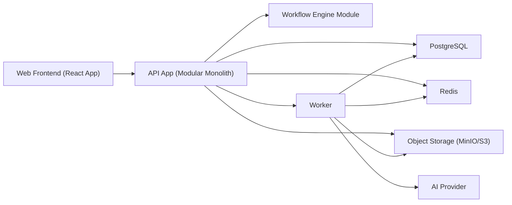

# 新点 SaaS 造价系统技术架构与平台选型方案

> 这份文档用于补齐当前文档体系中尚未系统化设计的 4 个关键问题：
> 1. 系统整体技术架构
> 2. 编程语言与技术栈选型
> 3. 数据库与存储类型设计
> 4. 工程量清单表格实现方式与低代码流程/表单引擎方案

## 1. 文档目标

当前项目已经完成了业务设计、数据模型、状态机、权限矩阵、接口契约和研发拆分，但还缺少一份“技术实现层面的总方案”。

这份文档要回答的是：

- 系统整体是单体还是微服务
- 前后端分别用什么语言和框架
- 主数据库、缓存、对象存储、搜索和异步任务怎么选
- 清单/定额这类重表格业务界面到底怎么实现
- 审核流、锁定流、过程单据流的“低代码流程和表单配置”怎么落

## 2. 总体架构结论

### 2.1 推荐架构

V1 推荐采用：

`前后端分离 + 模块化单体 + 独立异步任务 Worker + 工作流引擎内嵌`

也就是：

- 前端单独应用
- 后端先做成一个模块化单体
- 报表导出、批量重算、AI 推荐等异步能力单独跑 Worker
- 工作流引擎和表单引擎先作为平台模块内嵌，不单独拆平台

### 2.2 为什么现在不建议一开始做微服务

当前项目的核心难点不是“超大并发”，而是：

- 业务对象复杂
- 状态机复杂
- 权限边界复杂
- 清单、定额、审核、锁定之间事务关系很强

如果现在直接拆微服务，最容易出现：

- 跨服务事务过早复杂化
- 版本链、审核流和审计日志分散
- 团队调试成本陡增
- Sprint 1 到 Sprint 3 的交付速度明显变慢

所以 V1 的正确策略不是“先拆”，而是：

`先做模块化单体，把边界设计清楚，后面再按模块拆服务。`

### 2.3 推荐部署形态

### 2.4 后端模块边界

后端建议按模块组织，而不是按 controller/service/repository 平铺。

推荐至少拆成这些模块：

- `project-platform`
- `stage-config`
- `member-permission`
- `discipline-standard`
- `bill-versioning`
- `quota-pricing`
- `workflow-review`
- `reporting-export`
- `audit-log`
- `ai-assist`
- `import-adapter`

## 3. 编程语言与技术栈选型

## 3.1 前端选型

推荐：

- `TypeScript`
- `React`
- `Vite`
- `TanStack Query`
- `Zustand`
- `AG Grid Enterprise`
- `Ant Design` 或同类企业中后台组件库

### 原因

这个系统的前端不是普通表单页，而是：

- 多层级树表格
- 高密度编辑
- 列配置复杂
- 状态提示多
- 权限显隐多
- 需要和流程、审计、版本来源联动

`React + TypeScript` 对这种高交互中后台最稳。  
表格层不建议自己从零手写，应该直接选成熟 grid 内核。

## 3.2 后端选型

推荐：

- `Java 21`
- `Spring Boot 3`
- `Spring Web`
- `Spring Security`
- `Spring Data JPA` 或 `MyBatis-Flex / MyBatis Plus`
- `Flowable` 作为 BPMN 工作流引擎

### 为什么推荐 Java / Spring Boot

这套系统有几个明显特征：

- 审核、锁定、状态联动多
- 企业级权限控制重
- 工作流配置需求重
- 后续可能接 BPMN、报表、导入、规则引擎
- 国内企业团队对 Java 生态接受度高

而在这几个方面，Java 生态尤其是：

- `Spring Boot`
- `Flowable / Camunda / Activiti`

比 Node.js 更成熟，也更适合后续流程平台化。

### 为什么不推荐 V1 用 Node.js 做主后端

不是不能做，而是这类系统里 Node.js 的劣势更明显：

- 流程引擎生态弱
- 强事务业务设计成本更高
- 国内团队协作和后续招聘不如 Java 稳
- 审核流、导入流、报表流这类“企业后台重逻辑”场景，Java 更顺手

### ORM / SQL 建议

推荐原则：

- 核心事务模块优先可控 SQL
- 配置型模块可以用 ORM 提高开发效率

建议做法：

- `项目、阶段、成员、权限、流程定义` 用 JPA 也可以
- `清单、定额、汇总、批量更新、导入` 优先 MyBatis

换句话说：

`不要全 ORM，也不要全手写 JDBC。`

## 3.3 Worker 与异步任务

推荐：

- 同语言栈，仍用 `Java`
- 和主 API 工程共享 domain model
- 独立进程部署

负责：

- 报表导出
- 批量重算
- 导入解析
- AI 推荐调用
- 流程异步通知

## 4. 数据库与存储类型设计

## 4.1 主数据库

推荐：

- `PostgreSQL 16+`

### 原因

这个项目的核心数据非常适合 PostgreSQL：

- 强事务
- JSON 字段支持好
- 索引能力强
- 递归查询和层级数据处理能力好
- 未来可以接全文检索和向量扩展

### PostgreSQL 在本项目里的关键用途

- 主业务表
- 配置表
- 审计日志
- 表单 schema / 布局配置
- 流程定义元数据
- 版本链与来源链

## 4.2 缓存与临时状态

推荐：

- `Redis`

负责：

- 登录态和 token 黑名单
- 查询缓存
- 导入任务状态
- 报表导出任务状态
- 分布式锁
- 批量重算任务队列元数据

## 4.3 对象存储

推荐：

- 开发/私有化：`MinIO`
- 云上：`S3 / OSS / COS`

负责存：

- 导入原始文件
- 导出报表文件
- 大体积模板文件
- 审批附件

注意：

- 文件实体不要放数据库
- 数据库只存元数据和对象路径

## 4.4 搜索与向量

V1 建议：

- 暂不单独引入 Elasticsearch
- 暂不单独引入向量数据库

理由：

- 当前主业务压力不在全文搜索
- 清单和定额检索先用 PostgreSQL + 索引 + 条件查询即可
- AI 定额推荐前期可以先做规则 + embedding 混合，但 embedding 结果可先存 PostgreSQL

V1.1 以后再考虑：

- `pgvector`
- `Elasticsearch`

## 4.5 推荐基础设施清单

最终建议是：

- `PostgreSQL`
- `Redis`
- `MinIO / S3`
- `Java Worker`
- `Flowable`

V1 不建议一开始引入太多：

- Kafka
- Elasticsearch
- 独立规则引擎
- 独立数据仓库

## 5. 工程量清单表格实现方式

## 5.1 为什么这块不能按普通 CRUD 表格做

工程量清单和定额页面，本质上不是“列表页”，而是：

- 树形表格
- 多列编辑器
- 行级状态
- 来源链展示
- 批量编辑
- 公式重算
- 局部锁定
- 审核态只读
- 高密度键盘操作

所以这块必须按“领域表格引擎”来做，而不是普通 table 组件。

## 5.2 前端表格内核推荐

推荐：

- `AG Grid Enterprise`

### 原因

它更适合这个场景：

- 树结构
- 虚拟滚动
- 列冻结
- 批量编辑
- 自定义单元格编辑器
- 复杂状态渲染
- 行选择与区块选择
- 大数据量下性能更稳

### 为什么不建议 V1 用自己手写表格

因为你很快就会碰到这些需求：

- 层级折叠
- 列配置保存
- 单元格只读/可编辑切换
- 粘贴导入
- 键盘回车移动
- 行错误高亮
- 版本来源提示

这些都是成熟 grid 的强项，自己写代价太高。

## 5.3 清单表格的实现原则

### 数据存储层

不要把清单表格整体存成一个 JSON 大块。  
应该坚持：

- `bill_version`
- `bill_item`
- `bill_item_work_item`

这样的规范化存储。

表格只是“视图层”，不是存储层。

### 前端视图层

推荐做成：

- 主表格区：`bill_item`
- 明细/侧栏区：行详情、来源链、审核信息
- 下展开区：`bill_item_work_item`

### 编辑模式

推荐：

- 单元格即时编辑
- 本地脏数据缓冲
- 批量保存或行级 patch 提交

不建议每个单元格失焦就立刻全量提交。

### 版本与锁定控制

表格必须支持：

- 行级只读
- 列级只读
- 锁定版本整体只读
- 审核中只读
- 来源引用字段只读

### 关键前端能力

建议一开始就预留：

- 列显隐
- 列顺序保存
- 过滤条件保存
- 错误状态高亮
- 来源链标记
- 单元格 tooltip
- 键盘操作

## 5.4 定额表格的实现方式

定额表格建议不要完全独立成另一个巨大页面，而是和清单项联动：

- 左边清单树
- 中间定额明细 grid
- 右边定额详情 / 校验 / 来源

定额区的数据结构仍用：

- `quota_line`

不要存成前端私有矩阵。

## 5.5 后端接口建议

表格相关接口建议以“批量 patch”和“分页/版本上下文读取”为主。

例如：

- `GET /bill-items?versionId=...`
- `POST /bill-items/batch`
- `PUT /bill-items/{id}`
- `POST /bill-items/{id}/work-items/batch`
- `POST /quota-lines/batch`

不建议清单主表做“整表全量提交”。

## 6. 业务流程低代码引擎方案

## 6.1 先说结论

推荐：

`Flowable 作为流程执行引擎 + 自研轻量表单配置层`

也就是：

- 流程走 BPMN 引擎
- 表单不直接完全依赖 Flowable 自带 Form UI
- 我们自己维护表单 schema、布局和字段权限

### 为什么不建议直接买一个完整低代码平台来嵌进去

因为当前系统的主业务不是“通用 OA”，而是：

- 清单版本链
- 造价对象状态流转
- 锁定/解锁
- 提交审核
- 过程单据

这些都强依赖我们自己的领域模型。  
直接上完整低代码平台，最后往往会出现“双系统模型打架”。

## 6.2 流程引擎职责边界

流程引擎负责：

- 流程定义
- 节点流转
- 待办生成
- 审批动作
- 条件分支
- 抄送/通知

业务系统自己负责：

- 业务主数据
- 权限校验
- 表单渲染
- 审计日志
- 版本锁定
- 清单/定额/报表等领域规则

### 原则

`流程引擎驱动“节点流转”，业务系统掌握“业务真相”。`

## 6.3 V1 低代码能力边界

V1 不追求做通用低代码平台。  
V1 只做“流程与表单可配置”。

V1 推荐支持这些能力：

- 流程模板定义
- 节点配置
- 节点处理人规则
- 提交/审核/驳回/撤回
- 表单 schema 配置
- 字段显隐
- 字段只读
- 节点级表单布局
- 节点级必填校验

V1 不建议做：

- 通用页面拖拽搭建
- 自由公式编排平台
- 跨系统流程编排
- 通用报表设计器

## 6.4 表单引擎实现建议

推荐采用：

- `JSON Schema` 表达数据结构
- `UI Schema` 表达布局与组件
- 节点级字段权限规则表达“可见 / 可编辑 / 必填”

### 建议核心表

- `form_definition`
- `form_version`
- `form_schema`
- `form_layout`
- `form_submission`
- `workflow_definition`
- `workflow_version`
- `workflow_binding`
- `workflow_instance`
- `workflow_task`

### 表单组件类型建议

V1 先支持：

- 输入框
- 数字框
- 金额框
- 日期
- 单选
- 多选
- 下拉
- 人员选择
- 附件
- 文本域
- 表格子表
- 只读摘要块

### 表单配置绑定方式

建议支持：

- 按 `resource_type` 绑定流程
- 按 `stage_code` 绑定流程
- 按 `submission_type` 绑定表单

例如：

- `bill_version + 招标阶段 + submit_for_review`
- `contract_baseline + 合同阶段 + lock_request`
- `change_order + 施工阶段 + submit`

## 6.5 推荐实现策略

V1 推荐先实现三类流程：

### 1. 阶段成果提交流程

用于：

- 清单提交审核
- 阶段成果审核
- 驳回与通过

### 2. 锁定/解锁流程

用于：

- 合同清单锁定
- 版本解锁申请

### 3. 过程单据流程

用于：

- 设计变更
- 现场签证
- 进度款申报

这三类跑顺后，再逐步扩展。

## 6.6 前端表单渲染方式

推荐：

- React 动态表单渲染器
- 表单 schema 从后端拉取
- 前端按 schema 生成控件
- 节点权限控制字段编辑性

注意：

表单引擎和清单/定额 grid 不要混成同一个渲染体系。

建议分开：

- `普通流程表单` 用动态 schema renderer
- `清单/定额重表格` 用专用 grid renderer

## 7. 推荐最终技术栈

## 7.1 V1 最终推荐

### 前端

- `React`
- `TypeScript`
- `Vite`
- `Ant Design`
- `AG Grid Enterprise`
- `TanStack Query`
- `Zustand`

### 后端

- `Java 21`
- `Spring Boot 3`
- `Spring Security`
- `MyBatis + 局部 JPA`
- `Flowable`

### 基础设施

- `PostgreSQL`
- `Redis`
- `MinIO / S3`
- `Worker`

## 7.2 一句话架构结论

V1 最适合的方案是：

`React + TypeScript 前端，Java Spring Boot 模块化单体后端，PostgreSQL 主库，Redis 缓存，AG Grid 承载清单/定额重表格，Flowable + 自研表单配置层承载流程低代码能力。`

## 8. 下一步建议

在这份方案基础上，最值得继续补的有 3 份：

1. `deployment-architecture.md`
   明确开发、测试、生产环境部署拓扑。

2. `workflow-and-form-engine-design.md`
   继续展开流程定义、表单 schema、节点权限和绑定规则。

3. `bill-grid-implementation-design.md`
   继续展开清单 grid 的列模型、批量编辑、锁定态、patch 协议和性能策略。

